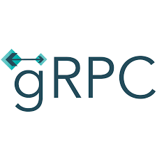

<p>
  Inspired by <b>Postman</b> and <b><a href="https://github.com/uw-labs/bloomrpc">Bloom RPC</a></b>
</p>

# Falcon RPC (falcon-rpc)

Falcon RPC

## Install the dependencies
```bash
yarn install
```

### Start the app in development mode (hot-code reloading, error reporting, etc.)
```bash
yarn dev
```

### Build the app for production
```bash
yarn build
```

<div float="left">
  
  
  
</div>
